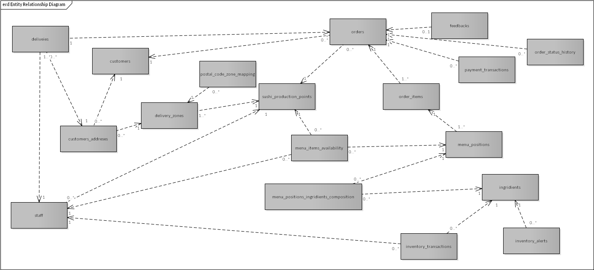
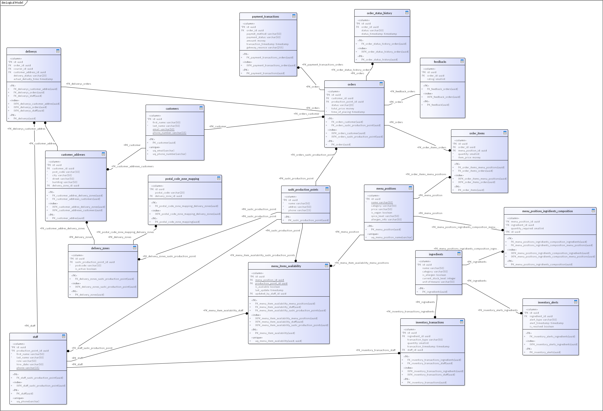

# Sushi Restaurant Delivery Database - Logical Model

## Project Overview

This is a logical database model designed for a sushi restaurant chain with online ordering, preparation, and delivery
capabilities.
The model supports multiple sushi production points, delivery zones, and a comprehensive order tracking system.

## Purpose

The database is designed to efficiently handle:

- Customer management and order processing
- Sushi preparation and inventory tracking
- Delivery logistics and courier management
- Payment processing and financial tracking
- Real-time menu availability and feedback systems

## Business Rules and Constraints

### Order Processing

1. Each order must be associated with exactly one customer
2. Orders must have at least one order item
3. Orders must be linked to a specific sushi production point
4. Orders must track all status changes through the order_status_history table
5. Payment must be recorded before order status can change to "preparing"
6. Delivery zones determine shushi poduction point which is going to prepare order

### Inventory Management

1. Ingredient stock levels must be updated when orders are processed
2. Inventory alerts are generated when ingredients fall below threshold levels
3. Menu items become unavailable when required ingredients are out of stock
4. Inventory transactions must track all stock movements (purchases, usage, waste)

### Delivery System

1. Customer addresses must be associated with valid delivery zones
2. Delivery zones are linked to specific sushi production points
3. Postal codes are mapped to delivery zones for automatic assignment
4. Staff assigned to deliveries must have courier role
5. Delivery status must be tracked and updated in real-time

### Payment Processing

1. Each order must have at least one payment transaction
2. Payment methods and statuses must be properly tracked

## Database Structure

### Core Tables

1. **Customers**
    - Customer identification and contact information
    - Supports customer management 
      - Applicability: Customer management, marketing, loyalty programs

2. **Customer_Addresses**
    - Multiple delivery addresses per customer
    - Links to delivery zones for accurate delivery estimation
      - Applicability: Order delivery, customer convenience

3. **Delivery_Zones**
    - Geographic service areas with specific delivery rules
      - Applicability: Delivery management, pricing strategy

4. **Postal_Code_Zone_Mapping**
    - Maps postal codes to appropriate delivery zones
    - Enables automatic zone assignment during checkout
      - Applicability: Streamlined order processing, accurate delivery estimates

5. **Sushi_Production_Points**
    - Restaurant locations that prepare orders
    - Manages production capacity and menu availability
      - Applicability: Order fulfillment, inventory management, staff assignment

6. **Staff**
    - Employee information including roles (chef, courier, etc.)
    - Supports workforce management and accountability
      - Applicability: Workforce management, delivery assignment, accountability

7. **Orders**
    - Core order information (customer, timestamp, total price)
    - Central to business operations and reporting
      - Applicability: Central business operations, reporting, analytics

8. **Order_Items**
    - Specific items in each order with quantities and prices
    - Links to menu positions for product information
      - Applicability: Order details, inventory management, menu popularity

9. **Payment_Transactions**
    - Financial transactions linked to orders
      - Applicability: Revenue tracking, financial reporting

10. **Deliveries**
    - Delivery details including address and courier
    - Manages logistics and delivery tracking
      - Applicability: Logistics management, delivery tracking, performance metrics

11. **Order_Status_History**
    - Complete history of order status changes
      - Applicability: Order tracking, staff accountability, customer communications

12. **Menu_Positions**
    - Available menu items with descriptions and prices
    - Core menu management and ordering interface
      - Applicability: Menu management, ordering interface, pricing strategy

13. **Ingredients**
    - Raw materials used in menu items
    - Supports inventory management and allergen tracking
      - Applicability: Inventory management, cost control, allergen tracking

14. **Menu_Positions_Ingredients_Composition**
    - Recipes showing ingredients required for each menu item
    - Enables inventory planning and cost calculation
      - Applicability: Production guidance, inventory planning, cost calculation

15. **Menu_Item_Availability**
    - Real-time availability of menu items at each location
    - Ensures order accuracy and customer satisfaction
      - Applicability: Order accuracy, customer satisfaction, inventory management

16. **Inventory_Transactions**
    - All ingredient stock movements
    - Supports inventory reconciliation and cost analysis
      - Applicability: Inventory reconciliation, cost analysis, loss prevention

17. **Inventory_Alerts**
    - Notifications for low stock or other inventory issues
    - Enables proactive inventory management
      - Applicability: Inventory management, procurement planning

18. **Feedbacks**
    - Customer ratings and comments
    - Supports quality control and menu improvement
      - Applicability: Quality control, customer satisfaction, menu improvement

## Logical Model

## Database Normalization

The database is designed to comply with Third Normal Form (3NF) principles:

- Each table has a proper primary key
- Non-key attributes depend only on the primary key
- Transitive dependencies have been eliminated
- Appropriate foreign keys maintain referential integrity

## Advanced Features

1. **Real-time Inventory Management**: The model supports live tracking of ingredient usage and automatic menu item
   availability updates.

2. **Performance Analytics**: Staff (especially couriers) can be evaluated based on order processing and delivery times.

3. **Customer Insights**: Order history and feedback provide data for personalized marketing and menu optimization.

4. **Financial Tracking**: Comprehensive payment transaction tracking enables detailed financial analysis.

